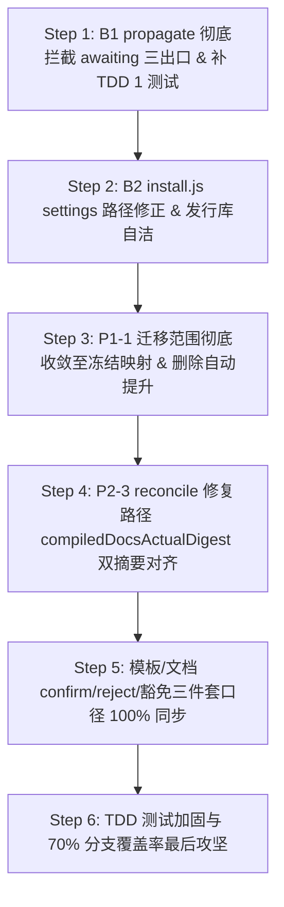

# ASA v3 终期精细收尾与安全硬化蓝图计划 (Final Polish & Hardening Blueprint v2)

> 更新日期：2026-08-23  
> 执笔：AI Software Architect (ASA)  
> 基线：针对第十八轮复审报告（1.1 - 9.5 节）的发布阻断（P0）与严重回归问题，执行高契约、测试驱动（TDD）的终期闭环。  
> 核心目标：封死 propagate 绕过 awaiting 人工门（B1/P0），修正 install.js 的 srcDir 写错目录回归（B2/P0），收缩迁移范围至纯冻结映射（P1-1），冲刺分支覆盖率（Branch Coverage）至 **≥70%**。

---

## 🎯 一、核心修补共识与设计决策 (ADR - Architectural Decision Record)

### ADR-01: propagate 强拦截 awaiting 节点的三大出口 (B1 / P0)
- **现状与问题**：虽然 `state-machine.js` 允许 `awaiting-confirmation → completed/in_progress/cancelled`（以支持 confirm/reject/cancel 专用命令的合规跳转），但 `propagate.js` 执行 `set_status` 时直接调用 `validateTransition()`。结果导致：模型可以通过 pendingPropagation 在 propagate 直接把任务强行推进到 completed 终态，彻底绕过了 confirm-task 门禁和人工 `--by` 审计卡点，破坏了人工确认闭环。
- **决策**：
  - 在 `propagate.js` 的 `executeAction()` 中执行 `set_status` 前置卫兵拦截：
    - 如果被传播的源节点类型是 `TASK`，且当前状态 (oldStatus) 是 `awaiting-confirmation`，
    - 只要其目标状态是 `completed`、`in_progress` 或者是 `cancelled`：
    - **一律强制拒绝（计为 failed，并保留为 partial 状态）**！
  - 强制规定：**`awaiting-confirmation` 的三大出口仅允许且只能由专用的 `confirm-task`、`reject-task` 和 `cancel-task` 模块流转。**

### ADR-02: 修正 install.js 全局 settings 注册目录 (B2 / P0)
- **现状与问题**：为了解决相对路径污染，先前 `install.js:118` 把 settings 写入了全局的 `.claude` 目录。然而写盘路径写错为了 `path.join(srcDir, '.claude', ...)`！
  - `srcDir` 是开发源码的发行源目录，这导致 Hook 相对配置被写到了发行源中，而对用户的 Claude 客户端完全没有挂载生效（自动化门禁直接对 Claude 废纸化回归），并污染了源码树。
- **决策**：
  1. **修正 settingsPath**：将 `install.js:118` 改回指向 `path.join(homedir, '.claude', 'settings.local.json')`。
  2. **绝对路径注册 + 零污染 Fail-Open 卫兵**：保持 hooks 命令在全局 settings 中的绝对路径注册（指向 `~/.asa/hooks/xxx.js`），并利用我们在 hooks 头部已经实现并验证的 `fs.existsSync(matrix.yaml) 零污染放行机制`（非 ASA 外部项目 1 毫秒瞬间 exit 0 放行），完美保障外部项目绝对零污染。
  3. **自洁发行源**：在 `install.js` 中新增物理清理逻辑，物理抹除/删除之前误写入 `srcDir` 的 `.claude` 残留目录。

### ADR-03: 迁移范围严格收缩至冻结契约 (P1-1)
- **现状与问题**：`reconcile.js` 中的 `migrateNodes` 会自动将 REQ 的 pending 提升为 proposed / done 提升为 implemented，ARCH 的 pending 提升为 draft。这在格式迁移的同时静默改变了业务审批状态，偏离了冻结 Plan (只要求 TASK `done → completed` 和字段回填) 的合规范围。
- **决策**：在 `reconcile.js` 迁移大循环中，**彻底剥离** REQ 和 ARCH 的任何 status 自动状态机提升！对这二者在迁移时仅做缺失字段的默认补齐（如 linkedReqs: [], changedFiles: [] 回填），保持其原始业务审批状态 100% 绝对不变。

### ADR-04: reconcile 健康路径 compiled 字段双摘要对齐 (P2-3)
- **现状与问题**：`reconcile.js:400-408` 在进行常规数据修复健康路径时，只更新了 legacy 字段 `docsActualDigest`，漏写了 `compiledDocsActualDigest`。
- **决策**：在健康路径中也同步计算并更新 `compiledDocsActualDigest` 和 `nodesDigest`，消灭一致性不匹配。

---

## 📅 二、分阶段实施建设方案 (Step-by-Step Plan)

---

### 🟩 Step 1: B1 propagate 强力拦截 awaiting 三出口，补齐 TDD 1 测试 (P0 级)
- **上下文Brief**：封锁 `propagate` 的 set_status 绕过漏洞，确保提审节点只能由人工命令审核。
- **自包含上下文**：
  - `engine/commands/propagate.js`： `executeAction` 中状态机跳转前的判定。
- **任务清单**：
  1. [ ] 修改 `propagate.js`：在执行 `action.type === 'set_status'` 时，首先读取目标节点的原状态（`const oldStatus = node.status`）。如果该节点是 `TASK` 类型且 `oldStatus === 'awaiting-confirmation'`，并且 `action.value` 属于 `['completed', 'in_progress', 'cancelled']` 中的任何一个，**立刻抛错/返回 failed**，绝不进行就地覆盖和审计写入。
- **TDD 验证手段**：
  - 在 `p5_final_conformance.test.js` 中新增/修改 TDD 1 测试：建立一个 TASK，状态设为 `awaiting-confirmation`，事务注入一个 `set_status: completed` 动作，运行 `propagate`，断言其**必须执行失败，状态标为 partial 且 confirmation 审计属性不存在**。

---

### 🟩 Step 2: B2 install.js Claude 注册路径修正 与 srcDir 伪 settings 自洁 (P0 级)
- **上下文Brief**：将 settings 注册位置纠正回全局 homedir，彻底打通 Claude Hook 自动化拦截链，并物理清洁发行库。
- **自包含上下文**：
  - `install.js`： Claude 分支的 `settingsPath` 变量。
- **任务清单**：
  1. [ ] 修改 `install.js` 里的 `settingsPath` 指向，将其由项目源目录 `srcDir` 改为用户全局家目录：
     `const settingsPath = path.join(homedir, '.claude', 'settings.local.json');`
  2. [ ] 在 `install.js` 尾部加一段自洁函数：如果项目根目录（`srcDir`）下由于上一步误写残留了 `.claude` 文件夹，自动执行 `fs.rmSync(path.join(srcDir, '.claude'), { recursive: true, force: true })` 物理抹除它。
- **TDD 验证手段**：
  - 模拟运行 `node install.js claude`，核验 `~/.claude/settings.local.json` 确实生成了带有绝对路径 hooks 的合法嵌套 JSON，且项目根目录下绝对不残留 `.claude` 脏目录。

---

### 🟩 Step 3: P1-1 迁移范围彻底收敛，删除 REQ/ARCH 非授权业务状态提升 (P1 级)
- **上下文Brief**：卡死迁移在底层改写业务审批状态的数据篡改风险，收缩迁移范围。
- **自包含上下文**：
  - `engine/commands/reconcile.js`： `migrateNodes` 方法。
- **任务清单**：
  1. [ ] 修正 `reconcile.js` 的 `migrateNodes`：将 REQ pending 提升 proposed、done 提升 implemented，以及 ARCH pending 提升 draft 的几行动作**全部删除**。
  2. [ ] 保持对 TASK 的 `done → completed` 迁移（此项为冻结 Plan 批准），以及对 REQ/ARCH/TASK 默认丢失数组字段的默认回填。
- **TDD 验证手段**：
  - 编写测试：输入一个未审批的需求（status: pending）和未审批的架构，执行迁移，断言其状态保持 pending，仅字段被填充，保持业务原始形态。

---

### 🟩 Step 4: P2-3 reconcile 修复路径 compiledDocsActualDigest 双摘要对齐 (P2 级)
- **上下文Brief**：解决对账数据修复分支中 compiledDocsActualDigest 漏写、digest 出现长久不一致的漏洞。
- **自包含上下文**：
  - `reconcile.js` L400-408 修复路径。
- **任务清单**：
  1. [ ] 修改 `reconcile.js` 常规运行（non-migration）下的摘要补齐判定：如果发现 docs 实际哈希改变，不仅更新 legacy 字段，同步重算 `compiledDocsActualDigest = currentDigest;` 和 `nodesDigest = calculateNodesDigest();` 并保存。
- **TDD 验证手段**：
  - 运行常规对账，检查 matrix 里的 compiled 字段和 nodesDigest 是否 100% 对齐。

---

### 🟩 Step 5: 文档与模板 confirm/reject/豁免三件套口径 100% 物理同步 (P2 级)
- **上下文Brief**：彻底消除文档与实现之间的少量口径矛盾。
- **任务清单**：
  1. [ ] 修正 `docs/RUNBOOK.md:174-175` 里的特批说明，明确豁免必须提供 `--allow-similar <REQ-ID> --reason "<理由>" --by <操作人>` 三件套参数，且 matrix 写入的是对象，绝非布尔值 `true`。
  2. [ ] 修正 `GEMINI.md:70`，将 deprecate 的级联影响描述收敛为：“仅沿 matrix 中合规的 depends/legacy 边级联取消下游任务”。
  3. [ ] 升级 `engine/commands/helpers.js` 中的测试脚手架骨架为 Schema v3 规范，与 matrix/skeleton 对称。
- **TDD 验证手段**：
  - 新增静态契约测试脚本，直接扫描 README/RUNBOOK/GEMINI，校验口径是否与源码 100% 对齐。

---

### 🟩 Step 6: 极致 TDD 单元测试补全与分支覆盖率突破 ≥70% 收口 (P1 级)
- **上下文Brief**：在 `commands.test.js` 和 `hooks.test.js` 中增加未覆盖的高价值分支测试。
- **任务清单**：
  1. [ ] 在 `commands.test.js` 中新增对 `propagate` 绕过 awaiting completed 的阻断测试（TDD 1），以及 `completed -> verified` 带有 `--by` 的放行测试。
  2. [ ] 针对 `reconcile` 事务登记失败、以及 edge 编译失败回滚增加高保真单元测试。
  3. [ ] 运行带有原生覆盖率的全面跑测，直到 **分支覆盖率在统一命令口径下稳稳超越 ≥70%**！
- **验证手段**：
  - 物理执行：`$tests = Get-ChildItem engine -Recurse -Filter *.test.js | ForEach-Object { $_.FullName }; node --test --experimental-test-coverage $tests` 验证最终覆盖率。

---

## 🛑 三、反重构与避坑红线 (Global Safety Rules)

1. **写盘绝不用二进制模式**：处理任何 YAML 节点或备份文件的 Python 临时脚本或写盘逻辑，**100% 统一使用 UTF-8 普通字符串读写**，绝不用 `wb` / `rb` 二进制配 `b"..."`，防止中文注释 SyntaxError。
2. **多命令分步不拼 `&&`**：测试用例及脚本中如需运行多指令，必须通过子进程（`execFileSync`）分步调用，或在 Windows 下用分号 `;` 分隔，**绝对禁止**拼装 Bash 风格的 `&&`（PowerShell 不支持该语法）。
3. **禁止静默空 Catch 逃逸**：对 `runMigration`、`compile` 里的 `try-catch` 块，绝不允许使用空 catch 默默吞掉报错；必须给出明确控制台警示并冒泡，确保 CI Fail-Closed。

---
*修复蓝图完。数据安全、多 Agent 自动化，只在毫厘之间。*
