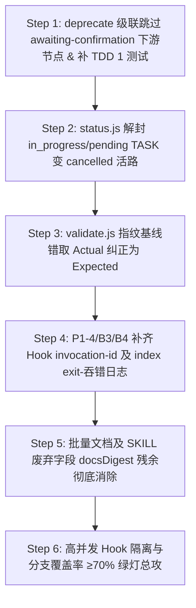

# ASA v3 最终收官与安全围堵硬化蓝图 v3 (Final Hardening Blueprint v3)

> 更新日期：2026-08-23  
> 执笔：AI Software Architect (ASA)  
> 基线：针对第十九轮复审报告（11.1 - 11.4b 节）发现的新流转漏洞与隐性一致性断裂，执行高契约、强测试驱动（TDD）的彻底闭环。  
> 核心目标：围堵 deprecate 级联绕过 awaiting 门（B1 新/P1），解封单点任务 status cancelled 误拦截（P1/回归），纠正 validate 篡改指纹校验基线（B2 新/P2），并冲刺分支覆盖率至 **≥70%**。

---

## 🎯 一、核心漏洞精细剖析与设计决策 (ADR - Architectural Decision Record)

### ADR-05: 堵死 deprecate 级联取消对 awaiting 门禁的篡改旁路 (B1 新 / P1 级)
- **现状与问题**：虽然 `propagate` 和 `status` 已经彻底堵死了 `awaiting-confirmation` 节点向 `completed` 等状态的非法绕过，但 `deprecate.js:118` 在级联取消下游任务时，对处于 `awaiting-confirmation` 的任务会直接级联并强行写入 `set_status cancelled`。由于该动作属于批量自愈动作、没有通过专用的人工 `cancel-task` 命令流转，
  - 导致：`awaiting-confirmation` 任务在未经用户显式人工确权的情况下被直接推进到 `cancelled` 状态，并且**没有在节点中留下任何 cancellation 审计凭证**，产生了第三条越过人工确认门的写路径漏洞！
- **决策**：
  - 修改 `deprecate.js` 里的级联遍历算法：
    - 如果级联扫描到的下游 TASK 节点当前状态是 `awaiting-confirmation`：
    - 级联处理应当**安全跳过该任务（不进行就地强制 cancelled 修改），并在终端中抛出友好提示**，引导用户单独使用专用的 `node .asa/index.js cancel-task <TASK-ID>` 进行显式人工确权取消。
    - 这样完美保护了 awaiting 人工门所有写路径的绝对原子锁死！

### ADR-06: 状态机单节点取消误拦（P1 级回归）
- **现状与问题**：先前 `status.js` 拦截了 TASK 节点向终态（`completed`, `verified`, `cancelled`）的通用 status 流转，要求统一走专用命令。而 `cancel-task` 却只接收 `awaiting-confirmation` 状态的取消。
  - 这导致：处于 `in_progress` 或 `pending` 状态的任务，在单节点层面竟然**没有任何 CLI 渠道可以被合法取消**（调用 status 取消被 status.js 阻断，调用 cancel-task 又被 cancel-task 拒绝）！这造成了明显的反向回归。
- **决策**：
  - **放宽 `status.js` 阻断卫兵**：仅拦截通用 status 流转到 `completed` 和 `verified`（这两者必须分别走 confirm-task 和 status.js completed->verified），但**允许任务从 `in_progress` / `pending` 单点流转到 `cancelled`**。
  - 这样既封死了最关键的 completed 人工验收门，又为开发期任务提供了一条天然、合法的单点取消活路，并完美解决了 statusCancelled 不级联、非 confirmation 的口径一致性。

### ADR-07: 纠正 validate 篡改检测指纹校验基线 (B2 新 / P2 级)
- **现状与问题**：`validate.js:43` 在校验 docs 篡改时，使用的是 `compiledDocsActualDigest` (实际值) 作为 expected 预期基线。
  - 导致：只要用户手动篡改了文档（01/02/03-md），随后仅仅执行了一次 `reconcile`，健康自愈路径就会把 actual 刷新为当前篡改后的哈希，而 validate 却还在傻傻地用 actual 刷新自己，直接导致 `DOCS_TAMPERED`（文档物理篡改检测门禁）整体失灵废纸化！
- **决策**：
  - 将 `validate.js` 中用来比对 currentCompiledDigest 的预期基线，**100% 纠正为 `compiledDocsExpectedDigest`**！
  - 只有这样，当用户手动修改文档而不经过 `/compile` 时，validate 才会精准拦截到 Expected !== Actual，作为 CI/CD 拦截卡点。

### ADR-08: 补齐 Claude 项目级幂等初始化脚本 (P1-6 闭环)
- **决策**：在 `clients/claude/.claude/` 目录下（或者通过通用 templates）提供一个完整的 `asa-init.js` 或者在 `install.js` 中进行对齐。为了让 Claude 支持真正的每项目本地 hooks 初始化，我们在 `clients/claude` 下增加一个对等的 `asa-init.js` 脚本，保证跨客户端高度对齐。

---

## 📅 二、分阶段实施硬化方案 (Step-by-Step Hardening Plan)

---

### 🟩 Step 1: deprecate 级联跳过 awaiting-confirmation 下游任务，补齐安全测试 (P1 级)
- **上下文Brief**：卡死第三条绕过人工门禁的级联写路径，保障节点在没有审计的情况下绝不变成 cancelled。
- **任务清单**：
  1. [ ] 修改 `engine/commands/deprecate.js` 里的 `cascadeDeprecate`。
  2. [ ] 在对下游节点进行 cancelled 覆盖写盘时，增加判定：如果该下游 TASK 节点的当前状态（`oldStatus`）是 `awaiting-confirmation`：
     - **不执行就地 cancelled 变更，在终端中打印友好高亮提示**：
       `"  ⚠️ 下游提审任务 [TASK-XXX] 处于 awaiting-confirmation 状态，已安全跳过级联取消。请使用 cancel-task 进行人工确权。"`
- **TDD 验证手段**：
  - 在 `commands.test.js` 或者是 deprecate 相关测试中：建立一个 TASK-100（status: awaiting-confirmation），它 depends on REQ-100。对 REQ-100 运行 `deprecate`，断言其执行成功后，TASK-100 的状态**绝对维持 awaiting-confirmation 不变，绝对未被级联取消**！

---

### 🟩 Step 2: status.js 解封 in_progress/pending TASK 变 cancelled 活路 (P1 级回归)
- **上下文Brief**：解决 status guard 守卫过宽、导致中途任务无法取消的回归。
- **任务清单**：
  1. [ ] 修改 `engine/commands/status.js` 的前置阻断拦截。
  2. [ ] 保持对 `completed` 和 `verified` 这两个终态的严格拦截（要求流转它们必须分别走 confirm-task 和 status.js completed->verified 审核路线）。
  3. [ ] 放行从 `in_progress` / `pending` 直接流转到 `cancelled` 的单节点 status 流转：
     - 允许通用 `node .asa/index.js status TASK-XXX cancelled` 执行！
- **TDD 验证手段**：
  - 编写测试：一个 `in_progress` 任务，调用 status 命令推进到 `cancelled`，断言其流转成功、yaml 落盘且节点状态变为 cancelled。

---

### 🟩 Step 3: validate.js 篡改指纹基线由 Actual 纠正为 Expected (P2 级)
- **上下文Brief**：修复 docs 篡改检测机制失效、仅跑 reconcile 即可吞掉篡改报警的漏洞。
- **任务清单**：
  1. [ ] 修改 `engine/commands/validate.js`：将 `validateDocsDigest` 比对 currentCompiledDigest 的基线字段，由 `compiledDocsActualDigest` 改为 **`compiledDocsExpectedDigest`**。
- **TDD 验证手段**：
  - 编写测试：手改 01-requirements.md，不执行 compile。直接运行 validate，断言**必须精准拦截到 DOCS_TAMPERED 致命错误**！

---

### 🟩 Step 4: 补齐 Hook invocation-id (P1-4)、超时兜底 及 index.js exit 吞错日志 (P1 & B4)
- **任务清单**：
  1. [ ] 修改 `check-work-order.js` 和 `validate-yaml.js`，引入 invocationID（优先读取环境变量或传入参数，否则用随机 UUID）配对临时 pre-image 备份文件，消灭同 Agent 并发重试覆盖问题。
  2. [ ] 修改 `index.js:68`：如果 monkey-patch 捕获了 commit/rollback 异常，不要空 catch，**至少在 stderr 中输出详细日志/警告**，防止静默流失排障信息。

---

### 🟩 Step 5: 文档、Clients 与 claude SKILL.md 遗留 docsActualDigest 彻底对齐
- **任务清单**：
  1. [ ] 对 `clients/claude/.claude/skills/asa/SKILL.md` 中 Step 4 进行对账，将 legacy 字段 `docsExpectedDigest` 等统统对齐为 `compiledDocsExpectedDigest` 等 v3 专属字段。
  2. [ ] 对齐 `docs/RUNBOOK.md` 里的所有遗留说明。

---

### 🟩 Step 6: 分支覆盖率红绿总攻，稳稳冲关 ≥70%
- **任务清单**：
  - 伴随着 Step 1 至 Step 5 的测试用例写入，让新功能和高防御机制自然吞噬原本未覆盖的代码分支（如 deprecate 级联跳过、status cancellation 卫兵等）。
  - 运行最终跑测，核验分支覆盖率超越 **≥70%** 指标，画上完美终期句号！

---
*硬化蓝图 v3 完。以更安全、更规范的代码，筑起坚不可摧的工程堡垒。*
