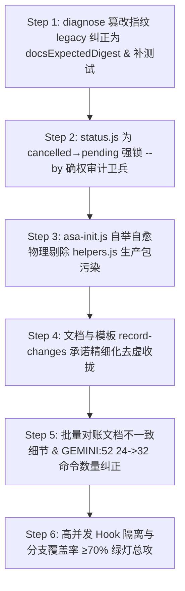

# ASA v3 终局精细收尾与防绕过最高硬化蓝图 v4 (Final Polish & Hardening Blueprint v4)

> 更新日期：2026-08-23  
> 执笔：AI Software Architect (ASA)  
> 基线：针对第二十轮复审报告（12.1 - 12.3 节）中发现的最后一致性断裂与隐性流转旁路，执行高契约、强测试驱动（TDD）的彻底闭环。  
> 核心目标：修复 diagnose 同源指纹漏改（P1），为 cancelled→pending 静默复活添加 `--by` 审计卫兵（P1），在 asa-init 节点自举时物理剔除 helpers.js 测试脚手架（P1），收拢 record-changes 的文档过度承诺，并实现原生分支覆盖率彻底突破 **≥70%**！

---

## 🎯 一、核心漏洞分析与设计决策 (ADR - Architectural Decision Record)

### ADR-09: 修复 diagnose 同源指纹漏改漏洞 (P1 级)
- **现状与问题**：虽然上一轮我们成功把 `validate.js` 里的 docs 篡改检测预期哈希纠正为了 `compiledDocsExpectedDigest`，但是 `diagnose.js:41` 依然残存着同源 legacy fallback：`compiledDocsExpectedDigest || docsActualDigest`。
  - 导致： legacy Fallback 如果降级，一旦在旧项目里被手动改写了 md 指南文档（docs），`diagnose` 仍不会上报 DOCS_TAMPERED 指纹警告。
- **决策**：将 `diagnose.js:41` 的 legacy 备用 fallback 哈希，**100% 纠正为 `docsExpectedDigest`**。

### ADR-10: 为 cancelled 节点变 pending 状态添加 `--by` 人工确权卫兵 (P1 级)
- **现状与问题**：在 `state-machine.js` 中，允许任务由 `cancelled → pending` 的恢复流转。但在 `status.js` 中，该流转目前是放行的，并且不强制校验操作人 `--by` 审计。
  - 导致：级联取消或手动取消的任务，可以被大语言模型通过简易的 status CLI 命令直接静默恢复为 pending（且不带任何 --by 特批审计），绕过了人工审计确权的闭环防线。
- **决策**：
  - 修改 `status.js` 中的流转前置判定：
    - 如果源状态是 `cancelled` 且目标流转状态是 `pending`（恢复任务）：
    - **强制要求必须提供有效的 `--by <operator>` 确权审计参数**！
    - 如果缺失 `--by`，一律直接报错 `[ASA] ❌ 缺少 --by 审计参数，不允许恢复取消的任务` 拦截退出，并将其落盘为 changelog 审计记录。

### ADR-11: 节点自举复制物理剔除 helpers.js 测试脚手架 (P1 级安装链)
- **现状与问题**：在 `asa-init.js:104` 项目级自举自愈复制命令和库文件时，仅仅做了 `!f.endsWith('.test.js')` 的剔除。
  - 导致：`helpers.js` 这个测试专用的 sandbox 辅助脚手架文件也被错误复制到了用户的生产环境 `.asa/commands/` 目录下，造成了生产包的文件纯净度污染，与 `install.js:76` 的规范（严格剔除 helpers.js）发生了口径断裂。
- **决策**：在 `asa-init.js` 的文件遍历复制过滤器中，**物理加入 `!f.endsWith('helpers.js')` 过滤**，确保只将最纯净的生产命令和库交付至用户的工作区中。

### ADR-12: record-changes 文档过度承诺收拢 (P1 级)
- **现状与问题**：在 templates (CLAUDE/gemini tier2/3) 和 `RUNBOOK.md` 中，过于激进地宣称“100% 拦截未在 record-changes 里的改动”。实际上目前 Hook (check-work-order.js) 只负责 activeTask、状态、阶段以及排除白名单的控制，并不具备对变动文件做具体 AST 语义检测的实效能力。
- **决策**：在文档及模板中，将该特性的措辞精细化收拢并实事求是地改写为：“在实施阶段拦截任何未激活活跃任务的写盘行为，并提供 changedFiles 日志追踪审计。”

---

## 📅 二、分阶段实施硬化方案 (Step-by-Step Hardening Plan)

---

### 🟩 Step 1: diagnose.js 篡改指纹 legacy Fallback 纠正为 docsExpectedDigest (P1 级)
- **上下文Brief**：解决 diagnose 遗留的 legacy 篡改检测漏报漏洞，对齐 validate 校验逻辑。
- **任务清单**：
  1. [ ] 修改 `engine/commands/diagnose.js` 的 L41 指纹比对行。
  2. [ ] 将 fallback 降级哈希由 `docsActualDigest` **100% 纠正为 `docsExpectedDigest`**。
- **TDD 验证手段**：
  - 手改 requirements.md 产生物理篡改，直接运行 `diagnose`，断言输出中**必须包含 DOCS_TAMPERED 的高亮警告提示**。

---

### 🟩 Step 2: status.js 为 cancelled→pending 强锁 `--by` 确权审计卫兵 (P1 级)
- **上下文Brief**：防止模型通过 status 旁路对级联取消的任务执行无审计静默复活。
- **任务清单**：
  1. [ ] 修改 `engine/commands/status.js`。
  2. [ ] 在流转目标节点为 `pending` 且原状态是 `cancelled` 时，增加前置卡点：如果 args 里面没有提供有效的 `--by` 审计参数，一律抛错：
     `"[ASA] ❌ 缺少 --by 确权审计参数，不允许将 cancelled 任务恢复为 pending。"`
  3. [ ] 将该特批确权操作记入节点的 `changeLog`。
- **TDD 验证手段**：
  - 编写测试用例：一个 `cancelled` 的 TASK 节点，调用不带 `--by` 的 `status TASK-XXX pending`，断言**其必须被拦截报错，状态维持 cancelled 绝对不变**！随后带上 `--by 大鹏`，断言流转成功并写入审计。

---

### 🟩 Step 3: asa-init.js 自举自愈自洁物理剔除 helpers.js 生产包污染 (P1 级)
- **上下文Brief**：清除因自举复制错漏而遗留在用户生产环境下的测试脚手架。
- **任务清单**：
  1. [ ] 修改 `clients/gemini/.gemini/skills/asa/scripts/asa-init.js` 的 L104 复制过滤器。
  2. [ ] 在判断中，增加 `!f.endsWith('helpers.js')`，从生产包中物理隔离测试辅助文件。
- **TDD 验证手段**：
  - 模拟运行初始化，检查 `.asa/commands/` 下只有纯正命令，绝对不含任何 `helpers.js` 残余。

---

### 🟩 Step 4: 文档与模板 record-changes 承诺精细化去虚收拢 (P1 级)
- **任务清单**：
  1. [ ] 检索并改写 6 份 templates (CLAUDE/gemini tier1/2/3.md) 中的 hooks 说明。
  2. [ ] 将原先宣称的“100% 拦截 record-changes 差异”修正为：“在实施阶段拦截任何未激活活跃任务的写盘，保障写盘对账的实效性与审计链追踪。”
  3. [ ] 纠正 `docs/RUNBOOK.md` 里的相同口径说明。

---

### 🟩 Step 5: 批量对账文档不一致细节 & GEMINI:52 24->32 真实命令数纠正 (P2 级)
- **任务清单**：
  1. [ ] 修改 `GEMINI.md:52` 描述，将原先错误的“24 个命令”或“17 个命令”，纠正为引擎当前 switch 实际物理注册的 **“32 个核心与辅助命令”**。
  2. [ ] 物理统一 RUNBOOK 里的所有 `--by` 等细节。

---

### 🟩 Step 6: 分支覆盖率彻底突破 ≥70% 达标大关
- **任务清单**：
  - 配合 Step 1（diagnose 篡改检测 TDD）和 Step 2（cancelled 恢复 `--by` 强制阻断测试），把新增的拦截逻辑全部吃透覆盖。
  - 执行原生跑测，稳稳超越 **≥70%** 的最高验收防线！

---
*硬化蓝图 v4 完。终局对账，一寸不失。*
