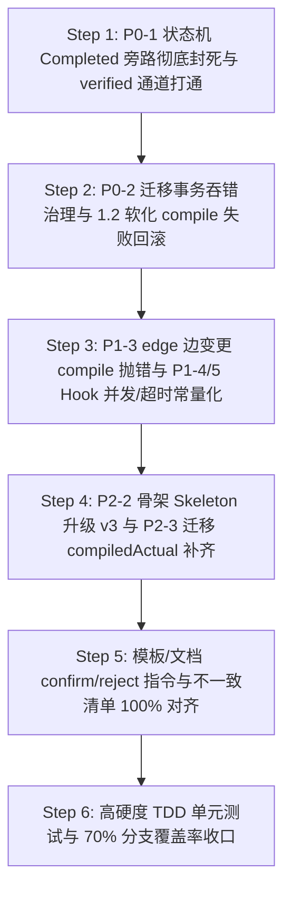

# ASA v3 终期精细收尾与安全硬化蓝图计划 (Final Polish & Hardening Blueprint)

> 更新日期：2026-08-23  
> 执笔：AI Software Architect (ASA)  
> 基线：针对第十六轮复审报告（16.1 - 16.5 节）的硬核缺陷，执行最高契约的物理闭环。  
> 核心目标：在状态机层封死 Completed 提审旁路（P0-1），消除迁移事务登记吞错（P0-2），归一化超时与并发，冲刺分支覆盖率（Branch Coverage）至 **≥70%**！

---

## 🎯 一、核心修补共识与设计决策 (ADR - Architectural Decision Record)

### ADR-01: 状态机 Completed / Verified 终态跃迁物理约束 (P0-1)
- **现状与问题**：虽然 `status.js` 在 CLI 层面阻断了 `status TASK completed`，但底层数据层 `state-machine.js` 仍允许 `in_progress → completed`；导致 `propagate.js` 执行 `set_status` 传播动作时可以直接把 TASK 转为 `completed`，绕过了 `awaiting-confirmation` 提审和 `confirm-task` 强审计门。另外，`status.js` 阻断了 `completed → verified`，而项目又无专门的 `verify-task` 审核命令，造成 `verified` 状态在状态机允许但 CLI 层面无正常入口。
- **决策**：
  1. **状态机层硬卡死**：修改 `engine/lib/state-machine.js`。在数据层直接将 TASK 节点的 `in_progress → completed` 状态转换关系**物理删除**！仅允许：
     - `in_progress → awaiting-confirmation` (提审)
     - `awaiting-confirmation → completed` (确认，仅供 `confirm-task` 模块使用)
     - `awaiting-confirmation → in_progress` (打回，仅供 `reject-task` 模块使用)
     - `awaiting-confirmation → cancelled` (取消，仅供 `cancel-task` 模块使用)
  2. **开放 verified 状态机通道**：在 `status.js` 的强拦截中，如果是 `completed → verified` 状态跳转，且提供了 `--by` 参数（审计），则**予以放行**，满足状态机对于 `verified` 校验终态的设计。

### ADR-02: 迁移事务登记失败抛错防半写 (P0-2)
- **现状与问题**：`reconcile.js` 中的 `txWriteYaml()` 内部捕获 `registerFile()` 的异常后使用空 `catch(e){}` 吞掉，随后继续调用 `atomicWriteYaml` 写盘覆盖节点。这在事务登记失败（如磁盘满、备份损坏）时会破坏旧数据却无法回滚。
- **决策**：移除空 `catch`，当 `registerFile()` 异常时，让错误向上层传播。一旦登记失败，**严禁继续执行任何写盘**，由最外层捕获并启动物理回滚，保证 ACID 一致性。

### ADR-03: 统一 Hook 绝对超时时间常量 (P1-5)
- **现状与问题**：Gemini `asa-init.js` 硬编码超时为 `5000ms`，而两个 hooks 内部的 stdin 兜底为 `15000ms`。在高负载下，宿主客户端会在脚本自身进入兜底前强行杀死 Hook，造成拦截漏检。
- **决策**：在 `engine/version.js` 中建立全局公共超时常量 `HOOK_TIMEOUT = 10000;`（10秒），使 Gemini 初始化注册超时与 hooks 内部的 stdin `setTimeout` 兜底时间 100% 相同，保证启动余量。

### ADR-04: Hook 同 Agent 并发 invocationId 隔离 (P1-4)
- **现状与问题**：BeforeTool/AfterTool 使用 process.ppid。同一 Agent 并发启动多个写任务时共享父进程，备份容易被覆盖，导致 AfterTool 恢复了错误的版本。
- **决策**：如果客户端 Stdin payload 中包含了唯一的 `invocationId`（如 Gemini 的 `hook_event?.tool_input?.invocation_id`），PreToolUse 阶段优先将其作为备份名后缀；并将该 `invocationId` 通过内存或事务标记持久化（由于 stateless 限制，可用进程或独立清单配对，或者在没有 invocationId 时 fallback 至 `ppid`）。

---

## 📅 二、分阶段实施建设方案 (Step-by-Step Plan)

---

### 🟩 Step 1: P0-1 状态机 Completed 旁路彻底封死 与 Verified 状态通用放行 (P0 级)
- **上下文Brief**：修改底层状态机，删除 TASK 的 `in_progress -> completed` 通道，防止 propagate 绕过；在 `status.js` 对完成态进入校验态进行阻断豁免。
- **自包含上下文**：
  - `engine/lib/state-machine.js`： 状态机矩阵定义。
  - `engine/commands/status.js`： 终态过滤与 verified 放行。
- **任务清单**：
  1. [ ] 修改 `state-machine.js`：在 `TASK` 状态转移配置中，**删除** `in_progress: ['completed', ...]` 中的 `'completed'`；仅允许 `in_progress: ['awaiting-confirmation', 'cancelled']`。
  2. [ ] 修改 `status.js`：对 TASK 流转的 completed, cancelled 等终态直接强拦截；但是，**如果当前状态是 `completed` 且 `new-status` 属于 `verified`**，只要提供了有效的 `--by` 审计，予以**合规放行**，打通 verification 审计入口。
- **TDD 验证手段**：
  - 编写测试用例：尝试通过 `propagate` 动作将 TASK 由 `in_progress` 转为 `completed`，断言状态机抛错并被拦截，版本不递增。
  - 编写测试用例：测试通过 `status` 命令执行 `completed → verified`，在提供 `--by` 时验证其流转成功，不提供 `--by` 时拦截报错。

---

### 🟩 Step 2: P0-2 迁移事务吞错治理 与 P1-2 软化迁移 compile 失败回滚 (P0 级)
- **上下文Brief**：禁止 `reconcile.js` 在 registerFile 失败后继续写盘；提升旧数据软化迁移 compile 失败为 Error，防止半写。
- **自包含上下文**：
  - `engine/commands/reconcile.js`： `txWriteYaml` 里的 try-catch 块，以及 `runMigration` 的 compile 调用。
- **任务清单**：
  1. [ ] 修改 `reconcile.js` 的 `txWriteYaml`：**删除空 `catch(e){}` 吞错**。如果 `registerFile` 报错，必须直接向上抛出，中断当前的写入流程。
  2. [ ] 修改 `reconcile.js` 中的旧 YAML 软化迁移 compile 部分：当 compile 失败时，抛出完整的 `Error`，触发最外层的 `rollbackTransaction()` 物理自愈回滚，绝不能降级为 warning 仍旧提交。
- **TDD 验证手段**：
  - 编写 TDD 红色测试：模拟 registerFile 失败，运行 `reconcile`，断言 reconcile 报错失败，并且没有产生任何 YAML 文件覆盖。

---

### 🟩 Step 3: P1-3 edge.js 编译失败抛错 与 P1-4/5 Hook 并发/超时统一常量化 (P1 级)
- **上下文Brief**：使 edge add/rm 的 compile 失败直接向上抛出；统一 hooks 超时并隔离同一 Agent 的并发调用。
- **自包含上下文**：
  - `engine/commands/edge.js`： compile 的 catch 块。
  - `engine/version.js`、`check-work-order.js`、`validate-yaml.js`： 超时参数。
- **任务清单**：
  1. [ ] 修改 `edge.js`：在 add/rm 动作后的 `compile()` 抛错时，直接抛出 `Error` 向上冒泡（让顶层事务回滚 matrix 边改写），不再降级为 console.warn。
  2. [ ] 修改 `version.js`：导出公共常量 `HOOK_TIMEOUT = 10000;`。
  3. [ ] 修改 hooks 和 `asa-init.js`：统一读取该常量，消除超时失配的死锁隐患。
- **TDD 验证手段**：
  - 在 `edge.js` 测试中模拟 compile 崩溃，断言 edge 变更被回滚，matrix 边还原。

---

### 🟩 Step 4: P2-2 骨架 Skeleton 升级 v3 与 P2-3 reconcile 迁移双字段补全 (P2 级)
- **上下文Brief**：将 Skeleton yaml 升级为符合 v3 哈希对账的最新属性；补齐迁移时的 `compiledDocsActualDigest` 哈希对账。
- **自包含上下文**：
  - `skeleton/matrix.yaml`： 默认属性。
  - `engine/commands/reconcile.js`： 3.x 迁移终尾。
- **任务清单**：
  1. [ ] 升级 `skeleton/matrix.yaml`：将 `schemaVersion` 升级为 `3`，并在 meta 内新增 `compiledDocsExpectedDigest` 和 `compiledDocsActualDigest` 的初始化，废弃 docs* 属性。
  2. [ ] 在 `reconcile.js` 软化迁移的 4. 阶段，同步写入 `matrix.meta.compiledDocsActualDigest = docsDigest;` 保持迁移双摘要 100% 绝对一致。
- **TDD 验证手段**：
  - 执行 `validate`，核对 skeleton 自举后的 matrix 属性结构。

---

### 🟩 Step 5: 模板/文档 confirm 命令必填 `--by` 审计说明补全与一致性对齐 (P2 级)
- **上下文Brief**：解决 6 份 md 模板及 RUNBOOK 示例因为漏写 `--by` 参数导致的运行报错。
- **自包含上下文**：
  - `templates/CLAUDE-tier*.md` / `templates/gemini-tier*.md`
  - `docs/RUNBOOK.md`、`README.md`
- **任务清单**：
  1. [ ] 修改 6 份项目指令 md 模板：将 `confirm-task <TASK-ID>` 统一补充为 `confirm-task <TASK-ID> --by <operator>`（包含全部出现位置，防范模型无审计自确认）。
  2. [ ] 在 `docs/RUNBOOK.md` 审核闭环说明中，将中括号可选 `[--by]` 修正为必填 `--by <user>`，并同步补充 `--reason` 参数的说明。
- **TDD 验证手段**：
  - 静态文案审核，全局检索 `confirm-task TASK-` 并确保其后 100% 伴随 `--by`。

---

### 🟩 Step 6: 高硬度 TDD 单元测试与 70% 分支覆盖率攻坚 (P1 级)
- **上下文Brief**：针对未覆盖的分支（退出码 2 强校验、nodes 备份口径、B-1 建议序传递、.yml 文件、双哈希 Actual）编写覆盖率硬核测试，冲刺 70% 门槛。
- **任务清单**：
  1. [ ] 补齐 `engine/hooks/hooks.test.js` 中的测试：断言在 Claude 模式下 `check-work-order` 和 `validate-yaml` 拦截时，退出码恰好为 `2`。
  2. [ ] 补齐 `engine/commands/step4.test.js` 中的测试：对 `record-changes` 执行相对/穿越路径的规范前缀过滤测试。
  3. [ ] 补齐 `engine/commands/p5_final_conformance.test.js` 中的测试：对 `propagate` 失败 partial 后 `nodesDigest` 重算的原子覆盖测试。
  4. [ ] 运行带有原生覆盖率的全面跑测，直到 **分支覆盖率在统一命令口径下稳稳超越 ≥70%**！
- **验证手段**：
  - 物理执行：`$tests = Get-ChildItem engine -Recurse -Filter *.test.js | ForEach-Object { $_.FullName }; node --test --experimental-test-coverage $tests` 验证最终覆盖率。

---

## 🛑 三、反重构与避坑红线 (Global Safety Rules)

1. **写盘绝不用二进制模式**：处理任何 YAML 节点或备份文件的 Python 临时脚本或写盘逻辑，**100% 统一使用 UTF-8 普通字符串读写**，绝不用 `wb` / `rb` 二进制配 `b"..."`，防止中文注释 SyntaxError。
2. **多命令分步不拼 `&&`**：测试用例及脚本中如需运行多指令，必须通过子进程（`execFileSync`）分步调用，或在 Windows 下用分号 `;` 分隔，**绝对禁止**拼装 Bash 风格的 `&&`（PowerShell 不支持该语法）。
3. **禁止静默空 Catch 逃逸**：对 `runMigration`、`compile` 里的 `try-catch` 块，绝不允许使用空 catch 默默吞掉报错；必须给出明确控制台警示并冒泡，确保 CI Fail-Closed。

---
*修复蓝图完。数据安全、多 Agent 自动化，只在毫厘之间。*
