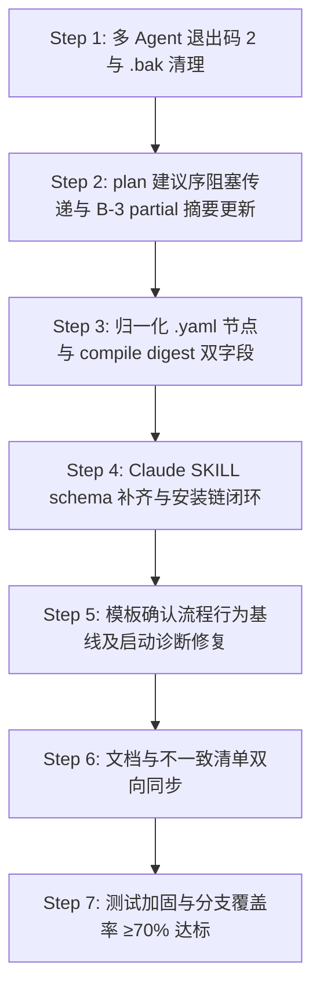

# ASA v3 终极修复与收尾蓝图计划 (Final Polish Blueprint)

> 日期：2026-08-22  
> 执笔：AI Software Architect (ASA)  
> 目标：彻底闭合第十四轮复审报告中指出的 12 大核心问题与一致性漂移，全量对齐文档与实现，加固多 Agent、多平台防护防呆，冲刺分支覆盖率（Branch Coverage）至 ≥70%。

---

## 🎯 1. 目标概述与核心考量

ASA v3 目前已基本实现状态机、查重、追溯、写锁等高契约底座。然而，离最终的全量物理冻结依然存在临门一脚的阻碍。
本蓝图旨在消除这最后的阻碍，主要解决以下高、中风险漏洞：
1. **多 Agent 阻断拦截在 Claude 端失效隐患**：PreToolUse 阻断在 Claude Code 中要求退出码必须是 `2`，当前仍在使用 `1`，这可能导致阻断被视为普通的底层执行故障而未形成对用户的拦截。
2. **plan 建议执行序自相矛盾**：在 `plan.js` 中，虽然 `ready` 的 awaiting 节点本身已被剔除，但它们下游的被阻塞任务依然由于拓扑入度在 awaiting 剔除前计算而泄漏在 `ready` 执行列表中，形成“上方提示 Blocked，下方却被建议执行”的矛盾。
3. **partial 执行后 digest 漂移导致 session-start 误警**：在 `propagate` 发生局部部分完成（partial，applied === 0 或部分节点写入）时，程序提前 `process.exit(1)` 却未重构 summary 和 compile，造成磁盘上 `.yaml` 节点的变动未同步至 `matrix.meta.nodesDigest`，使得 `session-start` 在只读启动诊断时误报“01/03 编译文档已篡改”。
4. **`.yml` 节点文件备份/校验/读取的三处不一致**：读取和编译只认 `.yaml`，但 `reconcile` 备份和 `validate-yaml` 校验却在支持 `.yml`，造成静默漏洞。
5. **行为基线（模板）确认流程颠倒**：模板一直指导“开发完毕直接 `confirm-task`”，但实现端强制要求任务必须先进入 `awaiting-confirmation` 状态，这导致严格按模板操作时 100% 报错拒绝，并存在模型“自我确认”的风险。
6. **Claude Skill schema 错误与 P4 安装链缺失**：SKILL.md 依然保留扁平数组，且 install.js 在 Claude 模式下并未像 Gemini 一样注册、拷贝幂等 `asa-init` 脚本，导致自动化交付未闭环。
7. **一致性漂移**：大量的命令参数（例如 `--reason` 别名、`allowSimilar` 对象的参数结构、`reject` 返回的 `in_progress` 状态、`cancel` 不再触碰依赖边）在 README / RUNBOOK / SKILL 中描述过期。

本计划将以 **TDD（测试驱动开发）** 为核心武器，每步修改先加断言，每步均执行本地全量跑测，并在最后完成文档与静态契约的 100% 收口，确保分支覆盖率稳步跃升至 **≥70%**。

---

## 🛠️ 2. 术语与架构共识 (ADR & Glossary)

### ADR-01: Claude PreToolUse 阻断状态退出码规范
- **决议**：在 `check-work-order.js` 和 `validate-yaml.js` 的 Claude 模式下，阻断（deny）的退出码统一强制设置为 `2`（Claude Code 官方 PreToolUse 阻断规范）。
- **影响**：使得宿主客户端能清晰捕获拦截动作，并生成红色的 PreToolUse 警告阻断提示，而不是当成底层的普通进程崩溃。

### ADR-02: plan.js 建议建议序 (suggestedOrder) 传递阻塞过滤算法
- **决议**：由于 awaiting-confirmation 节点是不允许模型开始执行的未确认状态，任何直接或间接依赖于 awaiting-confirmation 节点的下游任务都属于 **未就绪 (blocked)** 状态。
- **算法调整**：在 `plan.js` 中，过滤 `suggestedOrder` (即 `executableOrder`) 时，不但要剔除 awaiting 状态任务本身，还要利用图拓扑遍历，找出所有以 awaiting 任务为前序、并且在 non-completed 路径下的下游任务，一并从 `executableOrder` 中剔除。

### ADR-03: propagate partial 状态物理同步
- **决议**：在 `propagate.js` 执行 applied === 0 或者局部节点由于报错产生 partial 写入退出前，**必须强制**执行 `rebuildSummary` 和 `saveMatrix`，将写过的节点 hash 更新。
- **影响**：保持节点写盘与 `matrix.meta.nodesDigest` 的高保真、强一致，根除 session-start 启动时的假阳性警告。

### ADR-04: `.yml` 与 `.yaml` 数据契约一律归一
- **决议**：由于 Node.js 物理沙箱性能、索引完整性与防呆考虑，ASA 仅支持 `.yaml` 为标准后缀，不再对 `.yml` 进行半吊子读取。
- **调整**：一律将备份、对账、校验等文件的判定修正为 **仅限 `.yaml` 后缀**（对 `.yml` 文件在 reconcile 处自动重命名转换或完全不作备份），保持整体读取、备份、校验的三向物理对称。

---

## 📅 3. 分阶段实施建设方案 (Step-by-Step Plan)



### 🟩 Step 1: 多 Agent 退出码 2 阻断拦截与白名单 .bak 备份残留治理
- **上下文Brief**：多 Agent 的可靠阻断严重依赖退出码。此外，`.bak` 物理文件会在放行（allow）路径下因为没有 AfterTool 触发而被残留（尤其是白名单中的 `.asa/**/*.yaml` 也会被自动生成备份）。
- **任务清单**：
  1. [ ] 修改 `engine/hooks/check-work-order.js` 所有的 Claude 模式 `deny()` 路径，退出码从 `1` 修正为 `2`。
  2. [ ] 修改 `engine/hooks/validate-yaml.js` 所有的 Claude 模式 `deny()` 路径，退出码从 `1` 修正为 `2`。
  3. [ ] 修改 `check-work-order.js` 的备份逻辑：若写盘文件属于放行白名单（`.asa/**/*.yaml`、`docs/**/*.md`）或最终 `allow()` 放行，立即同步物理清理掉刚刚为该文件在 `PreToolUse` 创建的 `hook-*.bak`。不将其遗留至 60 秒的 TTL 清理。
- **验证手段**：
  - 运行 `node --test engine/hooks/hooks.test.js`。
  - 在 `hooks.test.js` 中新增断言：在 Claude 协议模式下阻断时，检查 `exitCode === 2`。
- **回滚策略**：直接通过 `git checkout` 或事务回退。

### 🟩 Step 2: plan.js 建议建议序的 awaiting 传递阻塞算法实现与 propagate partial 摘要刷新
- **上下文Brief**：必须解决 suggestedOrder 中的 awaiting 依赖穿透问题，同时在 propagate partial 退出前落盘摘要，消除启动期由于 nodesDigest 漂移产生的篡改误报。
- **任务清单**：
  1. [ ] 修改 `engine/commands/plan.js`：定义递归前序关系，或者在 Kahns 拓扑排序中，将 awaiting 任务的下游也标记为“被阻塞”状态。从最终显示的 `suggestedOrder` (即 `executableOrder`) 中彻底剔除任何“前序存在 active/incomplete 且状态为 awaiting”的任务。
  2. [ ] 修改 `engine/commands/propagate.js`：在 applied === 0 分支、或者局部部分处理（partial）由于非法参数发生 exit 之前，强制调用 `rebuildSummary()` 与 `saveMatrix()` (或 `compile()`) 重算 `nodesDigest` 并刷新 matrix。
- **验证手段**：
  - 在 `commands.test.js` 或新增测试中建立：一个 awaiting 任务 A 阻塞 B，B 阻塞 C。检查 `plan` 建议执行序：B 与 C 必须被剔除出 suggestedOrder，且 B、C 处于 blocked 列表。
  - 运行并发与 propagate 局部失败测试，检查 matrix 摘要是否与真实写盘的节点完全一致。

### 🟩 Step 3: 彻底归一化 `.yaml` 节点，解决 compile digest 字段不一致
- **上下文Brief**：三处 `.yml`/`.yaml` 后缀需要统一。此外，`compile.js` 必须同时写入 `compiledDocsExpectedDigest` 和 `compiledDocsActualDigest`。
- **任务清单**：
  1. [ ] 将 `reconcile.js` 和 `validate-yaml.js` 里的后缀匹配全部强制对齐到 `.yaml`。
  2. [ ] 升级 `compile.js`：在写入编译文档哈希时，同步在 matrix 写入 `compiledDocsExpectedDigest` 和 `compiledDocsActualDigest` 双字段。
  3. [ ] 兼容 `session-start.js` 的 legacy digest 读取：若 `compiledDocs*` 为空，自动向下兼容读取 `docsExpectedDigest`，防止全新初始化项目时启动闪退/误报。
- **验证手段**：
  - 运行 `node --test engine/lib/yaml.test.js` 与全量对账测试。

### 🟩 Step 4: Claude SKILL 嵌套 schema 补齐与安装链闭环
- **上下文Brief**：Claude 无法自动安装 hooks 的根源在于 `SKILL.md` 中 PreToolUse 扁平定义，并且 `install.js` 没有为 Claude 拷贝、建立 `asa-init`。
- **任务清单**：
  1. [ ] 修改 `clients/claude/.claude/skills/asa/SKILL.md`，将 `PreToolUse`/`PostToolUse` 部分重构为标准嵌套结构：
     ```json
     "hooks": [
       {
         "type": "command",
         "command": "node .asa/hooks/check-work-order.js"
       }
     ]
     ```
  2. [ ] 修改 `install.js` 的 Claude 安装路径：不仅拷贝 `SKILL.md`，同步在客户端下建立对应的 `hooks` 物理软链接，打通 P4 自动化拦截的最后一步。
- **验证手段**：
  - 模拟运行 `node install.js claude` 并核验产生的 settings 及软链文件形状。

### 🟩 Step 5: 行为基线（模板）确认流程与启动诊断修复
- **上下文Brief**：规范六套 md 模板，防止开发者模型因为错误的确认流程导致 self-confirmation 失败，并移除启动序列中违背“启动只读”的 `reconcile && patch`。
- **任务清单**：
  1. [ ] 修正 `templates/CLAUDE-tier1.md`, `templates/CLAUDE-tier2.md`, `templates/CLAUDE-tier3.md` 以及对应的三套 `templates/gemini-*.md` 文件：
     - 将开发完毕确认流程修正为：
       1. 开发完毕并跑通测试。
       2. 运行 `record-changes` 记录代码及关联需求变更。
       3. 执行 `status <id> awaiting-confirmation`，将状态转为待确认。
       4. 执行 `set active-task clear` 退出活跃开发（挂起），**等待大鹏（人类）手动进行 `confirm-task` 审核通过**。
     - **移除启动会话时强制执行 `reconcile && patch` 的指令**，统一修改为仅执行只读 `diagnose`（仅在诊断出漂移或异常时，由人类或策略建议触发对账与反写）。
- **验证手段**：
  - 静态核对 6 套模板，确保任务拆解规则语义正确无误。

### 🟩 Step 6: 终极双向同步：全量对齐文档、帮助块与豁免参数不一致清单
- **上下文Brief**：对大量的 README, RUNBOOK 里的过期参数、状态（如 reject 返回 pending vs in_progress、cancel 清关系边等）进行彻底的统一。
- **任务清单**：
  1. [ ] 修改 `README.md` 与 `docs/RUNBOOK.md`：
     - 明确 `reject` 命令的作用是：将状态转回 `in_progress`，而非 `pending`。
     - 明确 `cancel` 命令的作用是：级联取消，但**不直接物理删除或破坏 matrix 现有的依赖边**，而是依靠 validate 门禁进行未完成依赖的级联状态判断。
     - 修正豁免特批参数：把“仅 `--by` 即可特批”修正为“必须在 `--by` 的同时使用 `--allow-similar <top-id> --reason "<理由>"` 三件套豁免”。
     - 修正 `allowSimilar` 的描述：说明它是一个包含 id, reason, by 的嵌套数据结构。
     - 同步算法名：README/RUNBOOK 中将“向量余弦/分词”修正为“Bigram Dice (两元语法双关系重合度相似算法)”。
  2. [ ] 更新根目录 `GEMINI.md`：
     - 修改命令计数（20+ 个），将 `search`, `list`, `link`, `record-changes`, `diagnose`, `doctor` 等全部新加命令补充至快速命令表和参数列表。
  3. [ ] 重新生成或重写 `docs/ASA-GUIDE.html`。
  4. [ ] 更新 `docs/CONTRIBUTING.md` 的测试运行指南，将 `p0_safety` 到 `p5_final_conformance` 等全部 5 个安全/测试脚本写入说明。
- **验证手段**：
  - 静态文案对比，全局检索 `pending`、`余弦` 确认消除痕迹。

### 🟩 Step 7: 自动化 TDD 硬骨头：高覆盖率补齐与分支覆盖率冲刺 ≥70%
- **上下文Brief**：通过在测试文件中补充极限边界，将当前 64.68% 的分支覆盖率提升至 ≥70% 门槛。
- **任务清单**：
  1. [ ] 在 `engine/commands/commands.test.js` 和 `engine/hooks/hooks.test.js` 中新增测试分支：
     - 针对 `similarity.js` 在输入西里尔文/韩文等非 ASCII 时正则剥空的边界加测并处理。
     - 针对 `lock.js` 在 pid 为 NaN 或非数字字符时的损坏锁拦截分支补充单元测试。
     - 针对 `plan.js` 在 executableOrder 中 awaiting 任务的级联阻断与正确链展示进行极限拓扑断言。
     - 针对 `validate-yaml.js` 缺少 00/02 叙事文件时的告警与返回码测试。
     - 在 `engine/commands/p5_final_conformance.test.js` 中补全 `-r` 与 `--readonly` 的双重只读纯净度验证测试。
  2. [ ] 运行带有原生覆盖率的全面跑测，直至行覆盖率达标 (≥80%)、分支覆盖率达标 (≥70%)。
- **验证手段**：
  - 执行 `node --experimental-test-coverage --test <所有测试路径>`，监控生成的 coverage 报告。

---

## 🛑 4. 关键防范与反重构红线 (Anti-Pattern Catalog)

在执行本蓝图时，任何 Agent 必须严格恪守以下红线：
1. **禁止就地/直接修改 process.exit 或 process.cwd**：除了 hooks 顶级层，库层严禁通过 monkey-patch 等破坏性手段强改全局状态，任何错误应统一以 `throw new Error` 传递，由 `index.js` 的顶级 Catch 处理。
2. **禁止静默空 catch**：诸如 `compile` 或 `patch` 的失败绝对禁止以 `try { ... } catch(e) {}` 静默吞掉，必须给出 `console.error` 或由顶层控制其失败传递。
3. **保持零依赖 (Zero Dependency)**：不可为了多语言/相似度查重等引入任何外部第三方库（如 `lodash`, `yaml` ），必须坚持完全用 Node.js 的原生 `fs`/`path`/`os` 辅以高效、紧凑的本地函数手写解决。
4. **Windows Batch (BAT) 括号阻断防崩溃机制**：任何本蓝图涉及 Windows BAT/CMD 变动，绝对禁止在 if/for 括号内部放置含有中文、Emoji 的 echo，必须一律改写为 `goto` 扁平跳转跳转。

---

## 📈 5. 计划完成度与审查注册 (Review Gate)

- **第一责任人**：Gemini CLI & AI Software Architect
- **会话阻断门禁**：在每一步执行完毕后，必须运行本地全量测试并通过。若测试未通过，禁止强行提交。
- **注册凭证**：
  - 修复完成后，运行 `.asa/index.js validate` 进行最终的 CI 物理一致性复核。
  - 同步反写并生成新的 docs digest 到 matrix。

---
*蓝图终。准备进入执行阶段。*
