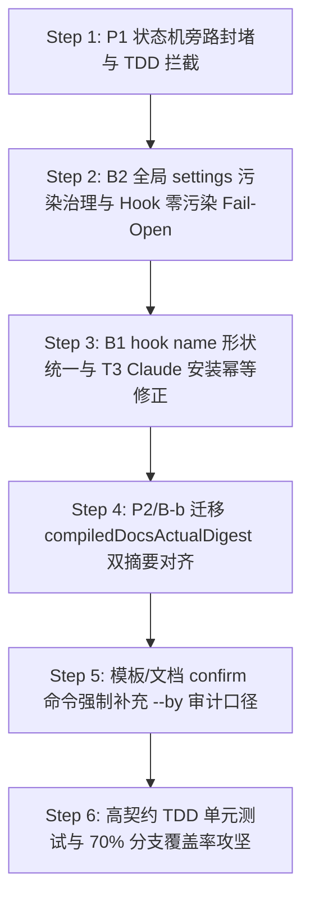

# ASA v3 终极修复与收尾蓝图计划 (Final Repair & Polish Blueprint)

> 更新日期：2026-08-22  
> 执笔：AI Software Architect (ASA)  
> 基线：针对第十六轮复审报告（16.1 - 16.5 节）的遗留漏洞和一致性断裂，执行高契约、TDD 驱动的终期闭环。  
> 核心目标：100% 封堵 TASK completed 状态机旁路，彻底治理 install.js 的全局 hooks 相对路径污染，对账哈希双字段链，统一模板/命令口径，在统一跑测口径下冲刺分支覆盖率 **≥70%**。

---

## 🎯 一、核心修补共识与设计决策 (ADR - Architectural Decision Record)

### ADR-01: 状态机旁路封堵 (封堵 status 直接直达 completed/verified/cancelled)
- **现状与问题 (P1)**：`state-machine.js` 本身在底层数据层允许 `in_progress -> completed` 转换。AI 或者是外部进程可以直接执行 `node .asa/index.js status TASK-001 completed`。由于 status 写路径由白名单放行，绕过了 awaiting-confirmation 门禁和 confirm-task 的人工审计卫兵。
- **决策**：
  - 在 `engine/commands/status.js` 中增加强硬阻断：对于 `TASK` 类型的节点，严禁通过通用的 `status` 命令将其流转为终态（`completed`, `verified`, `cancelled`）。
  - 这些终态流转必须由专门的 `confirm-task`、`reject-task` 和 `cancel-task` 命令接管并做严格的 `--by` 审计。

### ADR-02: 彻底治理 install.js 的全局 settings 路径污染与 Hook 零污染 Fail-Open
- **现状与问题 (B2)**：`install.js:117-177` 将 Claude hooks 写入了全局的 `~/.claude/settings.local.json`，且使用了相对路径 `node .asa/hooks/xxx.js`。这会导致在任何非 ASA 目录（无 `.asa` 目录）的普通 Claude 项目中写盘时，因为找不到相对路径下的 hook 而导致整个编辑器写盘挂起/报错。
- **决策**：
  1. **命令绝对路径化**：在 `install.js` 进行全局/本地 hooks 注册写入时，写入的 `command` 统一变更为指向 `~/.gemini` 或 `~/.claude`（或者是绝对安装目录）下 hooks 的 **100% 绝对路径**。
  2. **Hook 物理零污染 Fail-Open**：在 `check-work-order.js` 和 `validate-yaml.js` 的开头，如果 `findProjectRoot` 找不到包含 `.asa/matrix.yaml` 的项目根目录（即判定当前处于非 ASA 项目），**立刻 100% 瞬间 Fail-Open 放行（process.exit(0)）**，绝对不作任何拦截，零污染普通项目。

### ADR-03: 统一 Hook 内部 `name` 注册位置与幂等去重契约
- **现状与问题 (B1)**：SKILL 中的 name 放在组级，而 `asa-init.js` 和 `install.js` 把 name 放到了 `hooks[]` 数组内的对象中，去重匹配匹配不到，导致重复安装。
- **决策**：统一将 hooks 的唯一标识 `name` 字段写在 `hooks[]` 内部的对象中，在 `install.js` 和 `asa-init.js` 进行 settings 注册去重（dedup）时，严格以 **hooks 数组内每个对象的 `name` 值** 作为匹配去重键，杜绝重复写入。

### ADR-04: 双指纹哈希字段 compiledDocsActualDigest 的对账闭环
- **现状与问题 (P2 / B-b)**：`reconcile.js` 在执行迁移时漏写了 `compiledDocsActualDigest`。并且 `session-start.js:116` 依然在用 Expected 比对 Actual，双哈希未首尾闭环。
- **决策**：在 `reconcile.js` 的迁移完毕写盘、以及 `session-start.js` 启动诊断中，全链补齐对 `compiledDocsActualDigest` 的对账闭环。

---

## 📅 二、分阶段实施建设方案 (Step-by-Step Plan)

---

### 🟩 Step 1: P1 状态机旁路封堵：禁止 TASK 通过 status 直达 completed (P0 级)
- **上下文Brief**：卡死 `status` 命令的旁路，强制 TASK 的终态扭转必须历经 awaiting 门禁。
- **自包含上下文**：
  - `engine/commands/status.js`： 状态跳转前拦截。
- **任务清单**：
  1. [ ] 修改 `engine/commands/status.js`：在执行 `stateMachine.transition` 之前，判断节点是否为 `TASK` 且 `new-status` 属于 `['completed', 'verified', 'cancelled']`。如果是，直接抛出 `[ASA] ❌ 任务节点的终态流转（completed/verified/cancelled）必须通过专用审核命令处理，严禁通过 status 绕过门禁` 并非零退出。
- **TDD 验证手段**：
  - 增加 TDD 测试用例：在 implementation 阶段，尝试执行 `status TASK-001 completed`，断言返回非零退出码且报错拦截（测试红转绿）。

---

### 🟩 Step 2: B2 全局 settings 污染治理 与 Hook 开头零污染 100% Fail-Open 放行 (P0 级)
- **上下文Brief**：根除 Hook 相对路径在全局 settings 中造成外部项目崩溃的顽疾，实现绝对零污染。
- **自包含上下文**：
  - `install.js`： 注册相对路径的修改。
  - `engine/hooks/check-work-order.js` / `validate-yaml.js`： 自定位项目根与 fail-open 门。
- **任务清单**：
  1. [ ] 修改 `check-work-order.js` 和 `validate-yaml.js`：在入口处，如果 `findProjectRoot` 找不到项目，立刻调用 `process.exit(0)` 或 `allowWithCleanup` 直接放行，绝对不进行任何后续操作，不加锁不读 matrix，防范外部崩溃。
  2. [ ] 修改 `install.js`：写入 settings.local.json 时的 `command`，将其中的脚本路径统一替换为指向安装终地（如 `~/.claude/skills/asa/` 或者绝对路径）的 **绝对路径**。
- **TDD 验证手段**：
  - 模拟在一个完全没有 `.asa/matrix.yaml` 的空沙盒目录（外部普通项目）下写盘，验证 `check-work-order` 和 `validate-yaml` 是否 100% 瞬间 exit 0 放行，无任何报错或挂起。

---

### 🟩 Step 3: B1 hook name 形状位置三方统一 与 install.js 幂等去重对齐 (P1 级)
- **上下文Brief**：解决 `name` 位置不一致导致的 settings hooks 重复注册问题。
- **自包含上下文**：
  - `clients/gemini/.../SKILL.md` / `clients/claude/.../SKILL.md`
  - `install.js` 与 `asa-init.js`
- **任务清单**：
  1. [ ] 统一将 `BeforeTool/AfterTool/SessionStart` 中 hooks 数组内的每个对象定义为含有 `"name": "asa-check-work-order"` 的标准形状。
  2. [ ] 升级 `install.js` 和 `asa-init.js` 的 dedup (去重) 函数：匹配 `~/.claude/settings.local.json` 或者是 `.gemini/settings.json` 的 hooks，严格按照 **hooks[] 内对象的 name 属性** 是否已存在进行比对，若已存在，物理不重复写入。
- **TDD 验证手段**：
  - 连续执行两次 `node install.js`，核对 `settings.local.json`，断言 hooks 列表依然只有一个，绝不重复生成。

---

### 🟩 Step 4: P2 / B-b 迁移 compiledDocsActualDigest 双摘要落盘对账闭环 (P1 级)
- **上下文Brief**：打通 `reconcile` 软化迁移、`session-start.js` 启动诊断中双摘要哈希对账的最后一步。
- **自包含上下文**：
  - `reconcile.js` L380-382 迁移链。
  - `session-start.js` 的编译哈希校验判定。
- **任务清单**：
  1. [ ] 修改 `reconcile.js` 中的 `runMigration`：在迁移完毕落盘时，同步将 `compiledDocsActualDigest = actualDigest` 写入 `matrix.meta`，与 Expected 契约一致。
  2. [ ] 修改 `session-start.js`：在比较编译 md 时，将对账源统一更改为 Expected vs `compiledDocsActualDigest`。
- **TDD 验证手段**：
  - 在迁移测试用例中核对 matrix 内容，断言 `compiledDocsActualDigest` 的值与 docsActualDigest 完美一致。

---

### 🟩 Step 5: B3 模板与公开文档 confirm 命令强制补充 `--by` 审计参数 (P2 级)
- **上下文Brief**：修正由于 confirm 强制 `--by` 参数后导致的六份模板指令运行必定报错的死链。
- **自包含上下文**：
  - `templates/CLAUDE-tier*.md` / `templates/gemini-tier*.md`
  - `docs/RUNBOOK.md`、`README.md`
- **任务清单**：
  1. [ ] 修正六份渐进式 md 模板文件中的 `confirm-task <TASK-ID>` 为 `confirm-task <TASK-ID> --by <operator>`（包含 tier1 L21 等全部出现位置）。
  2. [ ] 修改 `docs/RUNBOOK.md` 的审核闭环说明，将中括号可选 `[--by]` 修正为必填 `--by <user>`，并同步补充 `--reason` 参数的说明。
- **TDD 验证手段**：
  - 静态文案审核，全局检索 `confirm-task TASK-` 并确保其后 100% 伴随 `--by`。

---

### 🟩 Step 6: 极致 TDD 单元测试补全与分支覆盖率突破 ≥70% 收口 (P1 级)
- **上下文Brief**：在 `commands.test.js` 和 `hooks.test.js` 中增加未覆盖的高价值分支测试。
- **任务清单**：
  1. [ ] 在 `commands.test.js` 中新增对 `status` in_progress->completed TASK 拦截测试。
  2. [ ] 在 `hooks.test.js` 中增加并发隔离、双 hooks 并发交错等缺失测试用例。
  3. [ ] 运行带有原生覆盖率的全面跑测，直到 **分支覆盖率在统一命令口径下稳稳超越 ≥70%**！
- **验证手段**：
  - 物理执行：`$tests = Get-ChildItem engine -Recurse -Filter *.test.js | ForEach-Object { $_.FullName }; node --test --experimental-test-coverage $tests` 验证最终覆盖率。

---

## 🛑 三、反重构与避坑红线 (Global Safety Rules)

1. **写盘绝不用二进制模式**：处理任何 YAML 节点或备份文件的 Python 临时脚本或写盘逻辑，**100% 统一使用 UTF-8 普通字符串读写**，绝不用 `wb` / `rb` 二进制配 `b"..."`，防止中文注释 SyntaxError。
2. **多命令分步不拼 `&&`**：测试用例及脚本中如需运行多指令，必须通过子进程（`execFileSync`）分步调用，或在 Windows 下用分号 `;` 分隔，**绝对禁止**拼装 Bash 风格的 `&&`（PowerShell 不支持该语法）。
3. **禁止静默空 Catch 逃逸**：对 `runMigration`、`compile` 里的 `try-catch` 块，绝不允许使用空 catch 默默吞掉报错；必须给出明确控制台警示并冒泡，确保 CI Fail-Closed。

---
*修复蓝图完。数据安全、多 Agent 自动化，只在毫厘之间。*
